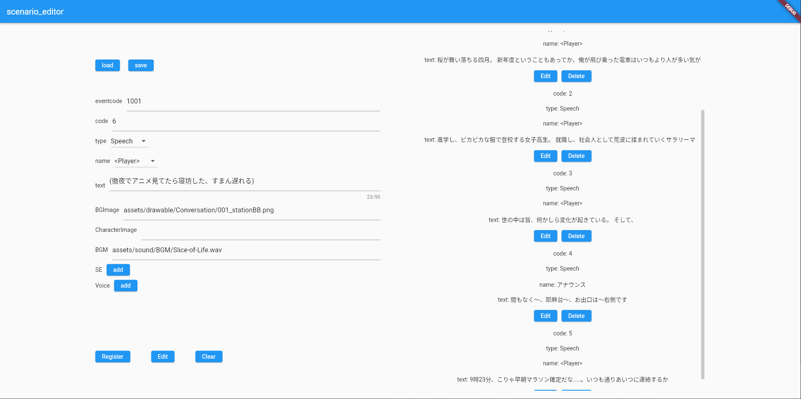

# 想咲 - ソウサク - シナリオエディター

ノベルゲーム "想咲 - ソウサク -" のシナリオファイルを簡単に作成できるソフトウェアです。  
このソフトウェアで作成したサンプルファイルは[こちら](1001.json)です。

### 特徴
- Webで動作可能(PWA対応)。
- ファイル内の番号によって順番が管理されており、途中に挿入、コンテキスト同士の入れ替え、削除といった基本的な操作が可能。
- 発話者は事前に設定されたキャラクターと自由記述が可能。
- 自由記述された発話者は2回目以降、プルダウンメニューから選択可能。
- Sound EffectとCharacter Voiceについては同時再生のための複数選択に対応。
- 対応するコンテキストタイプは以下の3種類

| Type     | 説明                      |
|:---------|:------------------------|
| Speech   | キャラクターやオブジェクトが発話する。     |
| Question | 画面中央に3つの選択肢が表示する。       |
| StatusUP | Playerの任意のステータス値を増減させる。 |

-----------------------------------------------------------------

制作者: yuyu [@stu-kensey](https://github.com/stu-kensey)  
製作期間: 2022/5/24 – 2022/6/10

現在はファイルの仕様が変わり大幅な変更が必要となったため、Google Sheetsを使用した新たな編集ツールを制作し、使用しています。
